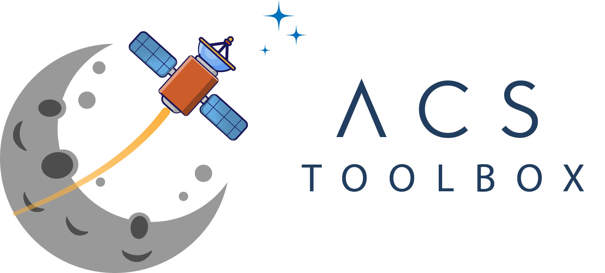

# ACS Toolbox Explain Document 

**ACS Toolbox** is a pure Python library developed by professional Guidance, Navigation and Control engineers for satellite Attitude Control System (ACS) design. The creators have engineered the ACS for notable and successful space missions such as GHGSat-D/C ([GHGSat](https://www.ghgsat.com/)), Kepler GEN1 Cluster ([Kepler Communications](https://www.keplercommunications.com/)) and AISSat-1/2 ([FFI](https://www.ffi.no/en)). Their designs have being utilized in over 30 satellites sent into orbit and showcased numerous times at the [European Space Agency GNC Conference](https://atpi.eventsair.com/QuickEventWebsitePortal/20a05-gnc-2020/website). 

The development and maintenance is sponsored by [Astris Aerospace Inc](https://www.astrisaerospace.com/). 

The ADC Toolbox explain document is attached as a PDF file. Please take a look at the `ACSToolbox.pdf`
